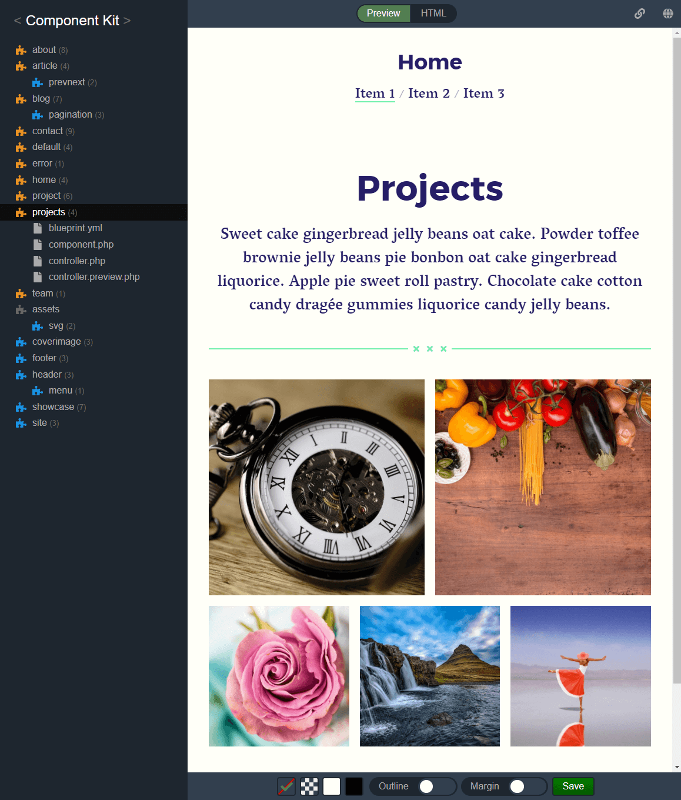

# Starterkit

There is a version of the starterkit built in as components.

## Setup

To use the starterkit you need to change the directory in the `config.php` file.

```php
c::set('component.kit.directory', kirby()->roots()->plugins() . '/kirby-component-kit/example/components');
```

You also need to add a css file path for the preview in the tool.

```php
c::set('component.kit.preview.css', '/component-kit/assets/assets/css/index.css');
```

If you have changed your folder structure, you need to change the options above accordingly.

## Usage

You can play with it and they are located in `/site/plugins/kirby-component-kit/example/components` if you use the default folder setup.

### Be aware

The components should work well in the tool, because the component/controller preview files does not require the content files.

But if you don't have the original content files, your site will not work, only the tool.

## Tool

When visiting the tool you should see all the components of the starterkit.

