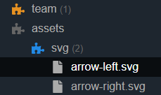
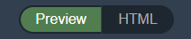
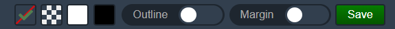

# Tool

## Sidebar

Components and their files are displayed in the sidebar.



- **Orange puzzle:** Template component
- **Gray puzzle:** A component folder without files
- **Blue puzzle:** A snippet component
- **Number:** File counter

## Views

To see the views you need to click a component in the sidebar.



### Preview

The preview is the default tab. I will preview the component which is the `component.php` or `component.preview.php` feeded with values from `controller.preview.php` if it exists.

### HTML

If you for some reason want to view the HTML, you can switch to this tab.

### Code

If you click a file that contains code and is allowed by the plugin, it will give a nice highlight code preview.

### Image

If you have a component that contains an image, you can click on it to get a nice preview. You will also get some information about the image in the bar below it.

## External links

To see the external links you need to click a component in the sidebar. You can find the external links up to the right.


### Raw preview

To see your component without the tool, you can click the link icon.

### Site link

This globe icon will take you to your site.

## Inspector

To see the inspector you need to click a component in the sidebar. Set the options that fit you the best and save your options.



### Background

In some cases you may need a background to get a nice preview of the elements inside the component. You can choose from no background, transparent (chess), white and black.

### Outline

How big is the element in the component? With the outline feature you can find out.

### Margin

Things close to the corners and sides can be hard to see without a margin. With this value you can preview the component with a margin. It may not work on elements positioned absolute or fixed.

### Save

The save button is only visible if there is no config file, or there has been changes to the values in the bar. When you save, there a `config.yml` will be created in the component folder. Because it's in YAML, it's easy to read an edit even outside the tool.

## Tool component files

**Without the tool, Component Kit will register these files:**

- `blueprint.yml` (template components)
- `controller.php` (template components)
- `component.php` (which can be a template or a snippet)

When using the tool, there are a few more files that will be used if they exists.

### component.preview.php

You can use a `component.preview.php` file. It will then be used in the tool instead of the `component.php`.

If `component.preview.php` does not exist, it will use `component.php` instead.

*In most cases you should not need this feature. Instead use the preview controller to manipulate the data.*

### controller.preview.php

While `controller.php` will only work with template controllers, the `controller.preview.php` will work with both template and snippet controllers.

Because the tool is not aware of your pages, the `controller.php` will never be used in the tool.

With the `controller.preview.php` you can send data to your templates and snippets in the tool. It will use the same syntax as the original `controller.php`. Because the preview controller is not aware of pages, you don't need to send `$pages` and `$page` as arguments to the preview controller.

**Example**

`controller.preview.php`:

```php
<?php
return function() {
    return [
        'copyright' => '© 2001–2012',
    ];
};
```

`component.php`:

```php
<?= $copyright ?>
```

### config.yml

When you use the inspector and save the values it will be stored in `config.yml`. It uses yaml because it's easy for a human to read and edit. You can edit it in your editor if you want.

**Example**

```yml
outline: true
margin: true
preview.background: transparent
```